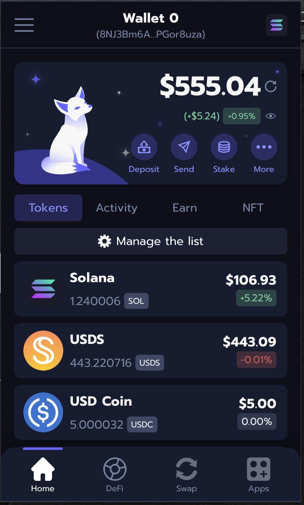

# Paweł Szydło

**Senior Frontend Engineer & Team Lead** based in Kraków, Poland.

I build React and TypeScript products with a focus on frontend architecture, maintainability, performance, and product-quality user experience. My recent work has been centered around crypto wallets, browser extensions, React Native mobile apps, blockchain integrations, and security-sensitive wallet UX.

Currently at **Synthetify Labs**, where I lead frontend development for product applications and a public browser extension used by approximately **300k users**. I coordinate a team of 6 developers across multiple product workstreams, support planning and code review, mentor engineers, and work closely with product and design on implementation direction.

[LinkedIn](https://linkedin.com/in/pawelszydlo) · [GitHub](https://github.com/Pawel-Szydlo) · [Email](mailto:pawel.szydlo.99@gmail.com)

## What I Work On

- Frontend architecture for React and TypeScript applications
- Browser extension development for Chrome and Firefox
- React Native mobile applications for iOS and Android
- Web3 wallets, asset management, transaction flows, and dApp integrations
- UI refactoring, performance improvements, and maintainable component systems
- Team leadership, mentoring, planning, code review, and delivery coordination

## Tech Stack

### Frontend

### Apps, Platforms & Tooling

### Web3

### Testing & AI-Assisted Work

## Featured Projects

### Nightly Extension

Public Chrome and Firefox browser extension for cryptocurrency wallet management, assets, transactions, and blockchain integrations.

- Led redesign work, new integrations, implementation priorities, and product-facing technical decisions
- Balanced usability, security-sensitive UX, maintainability, and browser-extension platform constraints

**Tech:**  

### Nightly Mobile

Public Android and iOS cryptocurrency wallet for asset management and multichain usage.

- Coordinated development work, testing, release readiness, and implementation decisions
- Worked across mobile wallet UX, product behavior, and multichain integration needs

**Tech:**  

### Synthetify

Frontend application for synthetic crypto asset borrowing and leverage flows.

- Implemented product flows for borrowing and leverage
- Worked on frontend delivery during the early product phase

**Tech:**  

## Experience

**Senior Frontend Engineer & Team Lead**  
**Synthetify Labs** · Sept 2021 - Present · Kraków, Poland

- Lead frontend development for product applications and a browser extension used by approximately 300k users
- Coordinate a team of 6 developers across three concurrent product workstreams
- Own planning, task breakdown, code review, mentoring, and frontend technical support
- Drove a frontend refactor covering architecture, UI structure, performance, and maintainability
- Collaborate with product and design on UI direction, product behavior, integrations, and partner support

## Education & Publications

**M.Sc. in Computer Science**  
Cracow University of Technology, Faculty of Computer Science and Telecommunication

- *Characteristics of price related fluctuations in non-fungible token (NFT) market*. *Chaos*, 2024. DOI: `10.1063/5.0185306`
- *Correlations versus noise in the NFT market*. *Chaos*, 2024. DOI: `10.1063/5.0214399`

## Languages

- Polish: Native
- English: B2

## Contact

I am open to remote, hybrid, or on-site opportunities in Kraków.

- LinkedIn: [linkedin.com/in/pawelszydlo](https://linkedin.com/in/pawelszydlo)
- Email: [pawel.szydlo.99@gmail.com](mailto:pawel.szydlo.99@gmail.com)
